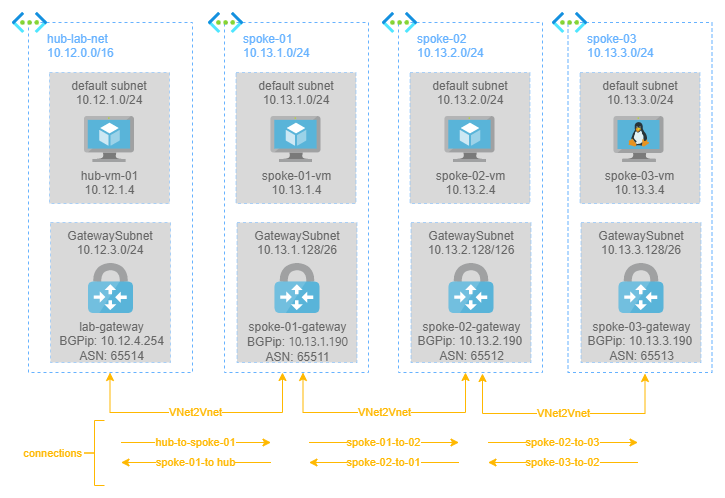

# SOLUTION: Routing cross hub with BGP

This solution shows how to configure the routing across 4 network hubs, using Virtual Network Gateways, Vnet2Net Connections and the BGP Protocol, as shown in the following schema.

* an Azure [Virtual Network Gateway](https://learn.microsoft.com/en-us/azure/vpn-gateway/vpn-gateway-about-vpngateways) is composed of two or more VMs that are automatically configured and deployed to a specific subnet you create called the gateway subnet. The gateway VMs contain routing tables and run specific gateway services.
* [VNet-to-VNet connections](https://learn.microsoft.com/en-us/azure/vpn-gateway/design#V2V) use a VPN gateway to provide a secure tunnel using IPsec/IKE to connect 2 virtual networks in a way similar to connecting a VNet to an on-premises site location. 
* [BGP is the standard routing protocol](https://learn.microsoft.com/en-us/azure/vpn-gateway/vpn-gateway-bgp-overview) commonly used in the Internet to exchange routing and reachability information between two or more networks. When used in the context of Azure Virtual Networks, BGP enables the Azure VPN Gateways called BGP peers or neighbors, to exchange "routes" that will inform both gateways on the availability and reachability for those prefixes to go through the gateways or routers involved. BGP can also enable transit routing among multiple networks by propagating routes a BGP gateway learns from one BGP peer to all other BGP peers.

## Pre-requisites

In order to apply this solution:

* deploy the `hub playground`
* remove all peerings

## Solution

Once all peering are removed, to allow routing across all hubs are required:

1. a Virtual Network Gateway in each spoke network
2. a Vnet-to-Vnet connection with BGP enabled between `hub-lab-net` and `Spoke01`
3. a Vnet-to-Vnet connection with BGP enabled between `spoke-01` and `spoke-02`
4. a Vnet-to-Vnet connection with BGP enabled between `spoke-02` and `spoke-03`

### Create a VPN Gateway in each spoke network

Create the following Azure Virtual Network Gateways:

| Name | Region  | Type  | VPN Type | SKU | Virtual Network | gw subnet range | IP | BGP | ANS
|---|---|---|---|---|---|---|---|---|---|
|spoke-01-gateway| west-europe  | VPN | route based   | VpnGw1   | spoke-01 | 10.13.1.128/26 | spoke-01-ip | Enabled | 65511 
|spoke-02-gateway| west-europe  | VPN | route based   | VpnGw1   | spoke-02 | 10.13.2.128/26 | spoke-02-ip | Enabled | 65512 
|spoke-03-gateway| north-europe | VPN | route based   | VpnGw1   | spoke-03 | 10.13.3.128/26 | spoke-03-ip | Enabled | 65513 

On `lab-gateway` also **enable BGP** and set ANS=`65514`

### Create all the VNet2-VNet connections
2 VPN gateways to communicate need 2 connections: one from the first to the second, and another from the second to the first. Therefore, for our topologym the following connections are needed:

| Connection Name | Type | From | To | PSK | Enable BGP |
|---|---|---|---|---|---|
| hub-to-spoke-01 | Vnet-2-Vnet | lab-gateway | spoke-01-gateway | password.123 | YES |
| spoke-01-to-hub | Vnet-2-Vnet | spoke-01-gateway | lab-gateway | password.123 | YES |
| spoke-01-to-02 | Vnet-2-Vnet | spoke-01-gateway | spoke-02-gateway | password.123 | YES |
| spoke-02-to-01 | Vnet-2-Vnet | spoke-02-gateway | spoke-01-gateway | password.123 | YES |
| spoke-02-to-03 | Vnet-2-Vnet | spoke-02-gateway | spoke-03-gateway | password.123 | YES |
| spoke-03-to-02 | Vnet-2-Vnet | spoke-03-gateway | spoke-02-gateway | password.123 | YES |

## Test Solution
Wait a few minutes, until all previously created connections have a `connected` status.

Go to `lab-gateways` > bgp peers > learned routes to verify that all route are propagated. YOu will see the following:

| network CIDR | next hop | local address | source peer | origin | AS path |
|---|---|---|---|---|---|
| 10.12.0.0/16 | - | 10.12.4.254 | 10.12.4.254 | Network | - |
| 10.13.1.190/32 | - | 10.12.4.254 | 10.12.4.254 | Network | - |
| 10.13.1.0/24 | 10.13.1.190 | 10.12.4.254 | 10.13.1.190 | EBgp | 65511 |
| 10.13.2.0/24 | 10.13.1.190 | 10.12.4.254 | 10.13.1.190 | EBgp | 65511-65512 |
| 10.13.3.0/24 | 10.13.1.190 | 10.12.4.254 |10.13.1.190 | EBgp | 65511-65512-65513 |

Each Virtual Network Gateway in this context is an Autonomous System (AS), in this table, the `AS path` lists all the ASes that need to be traversed to reach the location where the `network` that the path is attached to is advertised from. As such, a traceroute should encounter those same ASes.

From the table above, you can see that a machine in lab-hub-net to arrive to a machine in spoke-03 net (10.13.3.0/24), have to cross `65511` (`spoke-01-gateway`), `65512` (`spoke-02-gateway`) and `65513` (`spoke-03-gateway`).

### RDP connection test
1. connect via bastion `hub-01-vm` in RDP 
2. once on the vm, open remote desktop connection and connect to `10.13.2.`4 (a Windows VM)
