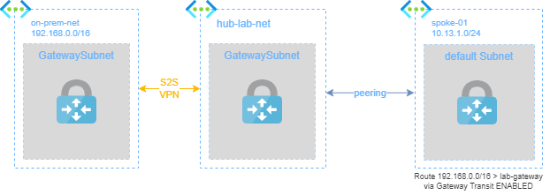
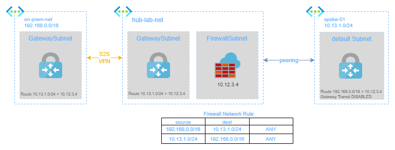

# SOLUTION: Use Azure Firewall to perimeter inspection (North/South Traffic)  

This solution shows how to inspect and eventually filter traffic with Azure Firewall between `spoke-01` and `on-prem-net` networks.

## Pre-requisites

In order to apply this solution:

1. deploy **hub** playground
2. deploy **on-premise** playground
3. send firewall logs to a Log Analytics workspace, as [documented here](logs.md)
4. connect on-prem and hub with a Site-to-Site IPSec connection, as [documented here](ipsec.md)

## Solution
When a S2S connection is established, routing between `on-prem-net` and `spoke-01` is possible thanks to the following configuration:

The configuration that allows to route all network traffic via Azure Firewall is the following:

### Configure Firewall Policy
With this policy Azure Firewall allows the communications bewteen `on-prem-net` and `spoke-01`.

Create the following `IP Groups` in `west europe`:
* `group-spoke-01`: 10.13.1.0/24
* `group-on-prem`: 192.168.0.0/16

Create the following Firewall Policy: `hub-fw-policy`

**Network Rules**:
* Rule Collection Name: `my-collection`
* Rule Collection type: Network
* Priority: `1000`
* Rule Colletion action: `Allow`
* Rule Collection group: `DefaultNetworkRuleCollectionGroup`

| rule name | source | port | protocol | destination | 
|---|---|---|---|---|
| on-prem-2-spoke-01 | group-on-prem | * | Any | group-spoke-01 | 
| spoke-01-2-on-prem | group-spoke-01 | * | Any | group-on-prem | 

Associate the policy `hub-fw-policy` to `lab-firewall` via Firewall Manager.

### Create User Defined Route for spoke-01
Go to `spoke-01` -> peerings -> `spoke01-to-hub` and set Virtual network gateway to `None`.

Create the following route table in `west europe`: `spokes-01-to-onprem`

Propagate gateway routes: `NO`

| Name | Address Prefix | Next hop type | Next hop IP addr |
|---|---|---|---|
| to-onprem | 192.168.0.0/16 | Virtual appliance | 10.12.3.4 |

| subnet Name | Virtual Network |
|---|---|
| default | spoke-01 |

### Create User Defined Route for Azure Virtual Network Gateway's subnet
Create the following route table in `west europe`: `gateway-routes`

Propagate gateway routes: `NO`

| Name | Address Prefix | Next hop type | Next hop IP addr |
|---|---|---|---|
| to-spoke-01 | 10.13.1.0/24 | Virtual Appliance | 10.12.3.4 |

| subnet Name | Virtual Network |
|---|---|
| GatewaySubnet | hub-lab-net |

## Test Solution

Connect via RDP from `w10-onprem` (`192.168.1.4`) to `spoke-01-vm` (`10.13.1.4`).
After that the connection is estabilished, go to `lab-firewall` -> Logs -> click on `Run` button in **Network Rule Log Data** Box.

In the Result pane, the first row should be something like:

| Time | msg | Protocol | SourceIP | srcport| TargetIp | target port | Action |
|---|---|----|---|---|---|---|---|
|...|...|TCP|192.168.1.4|xxx|10.13.1.4|3389|**Allow**|
|...|...|UDP|192.168.1.4|xxx|10.13.1.4|3389|**Allow**|

> Log ingestion from Azure Firewall can require from 60 seconds to 15 minutes, so if nothing is displayed, wait some minute and try again.
